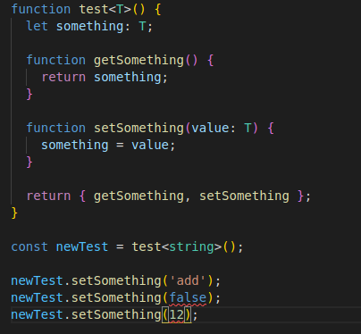

# Typescript & Typescript no ReactJS

## Tipos mais comuns, contando com os primitivos:

- `any`: Como o nome já diz, pode ser qualquer tipo. ( má prática )
- `void`: Utilizamos em uma função que não retorna nada.
- `string`: Auto explicativo, é uma string.
- `number`: Auto explicativo, é um number.
- `boolean`: Auto explicativo, é um boolean.

## Para criar arrays:

- `string[]`: é um array de string, isso serve para qualquer tipo inclusive para tipos criados com interface ou type.
- `Array<string>`: mesma coisa, no entanto, utiliza a notação de generic.

## Tuplas typescript:

- Muitas vezes precisamos que não só os tipos dentro de um array batam com a tipagem, mas também precisamos de uma quantidade/ordem de dados exata.
- Por exemplo: ` const arrayWithTwoNumbers: [string, number] = ['joao', 1]`
- Não podemos modificar uma tupla com métodos tipo: splice, etc...

## Diferenças e "semelhanças" entre type e interface:

- Declaração:
- Types: `type User = { name: string; age: number; }`
- Interfaces: `interface User { name: string; age: number; }`
- Extendendo propriedades:
- Types:
  - `type passaroTypeDefault = { asas: 2 }`
  - `type passaroProntoType = { noturno: true } & passaroTypeDefault`
- Interfaces:
  - `interface passaroDefaultI { asas: 2 }`
  - `interface passaroProntoI extends passaroDefaultI { noturno: true }`
- Podemos declarar a mesma interface duas vezes, portanto ela iria adicionar os atributos que forem somados na segunda vez a interface que já existe. ( enquanto com type não podemos fazer isso )
- Exemplo interface pode:
  - 
- Exemplo type não pode:
  - 

## Vantagens de utilizar interface:

- Facilita a visualização das mensagens de erro ( bom pra libs ).
- Mais semelhante a uma "orientação a objetos", por conta da notação, etc...

## Vantages de utilizar type:

- Para tipos primitivos.
- Para tuplas.
- Para extender alguma tipagem, pois só colocamos o `&` para extender.

## Generics ( Se adapta ao que for necessário e depois recebe só isso )

- O Generic começa aceitando qualquer coisa, após você atribuir uma primeira vez ele passa a aceitar somente aquele tipo de dado, seja number, string, etc...
- Exemplo de como utilizamos um Generic na prática ( dentro de `<>` passamos o tipo que queremos que ele se "adapte"):
  - 
- Nós podemos também, começar extendendo tipos de um generic, dessa forma ele já começa aceitando apenas alguns tipos, por exemplo:
  - 

## Type Utilities

- _Readonly_: Apenas leitura --> podemos colocar em qualquer variavel, etc..
- _Partial_: Podemos enviar parcialmente atributos de um tipo, não é necessário enviar todos, exemplo:
  - 
- _Pick_: Podemos selecionar apenas os tipos que queremos para criar outro tipo com base no anterior, por exemplo:
  - 
  - Dessa forma pegamos apenas o title e o completed, sem levar a description em consideração.
- _Omit_: Com o omit nós omitimos quais tipos não queremos de um outro tipo para criar o nosso novo, por exemplo:
  - 
- Basicamente quando queremos poucos tipos de uma interface usamos o pick para selecionar 1 por 1 quais queremos, mas quando queremos vários tipos daquela interface exceto alguns poucos utilizamos o omit para omitir quais não queremos.

# Falando um pouco de Typescript no ReactJS

## Para tipar hooks em componentes funcionais:

- Utilizamos generics, por exemplo: `let [name, setName] = useState<string>('joao')`

## Tipando Props em um componente funcional React:

- É muito comum criarmos uma `interface` para realizar esse trabalho.
  - `interface HeaderProps { title: string; }`
  - `function Header(props: HeaderProps) { }`
- Para recebermos o famoso `children` nas props temos o tipo ( React.ReactNode ):
  - 

## Por que não usar React.FC para tipar seus componentes funcionais ?

- Temos um children implicito, portanto podemos utilizar a qualquer momento sem mesmo declarar.
- O FC além de tipar a função, tipa também os argumentos da mesma de uma única vez.
- Vai ser depreciado.
- Não tem como utilizar o defaultProps: `ComponentName.defaultProps = { name: 'blabla' }`.
- O template mais famoso do react --> CRA, retirou o `FC` do template, validando mais o que está sendo dito.

## Se não devemos tipar nosso componentes funcionais com React.FC o que devemos utilizar ?

- Tipar as props "individualmente", no recebimento das mesmas.
- Tipar o retorno individualmente também, por exemplo: `JSX.Element`, etc..
- Caso queira receber o `children`, utilize o `React.ReactNode` como já mencionado.
